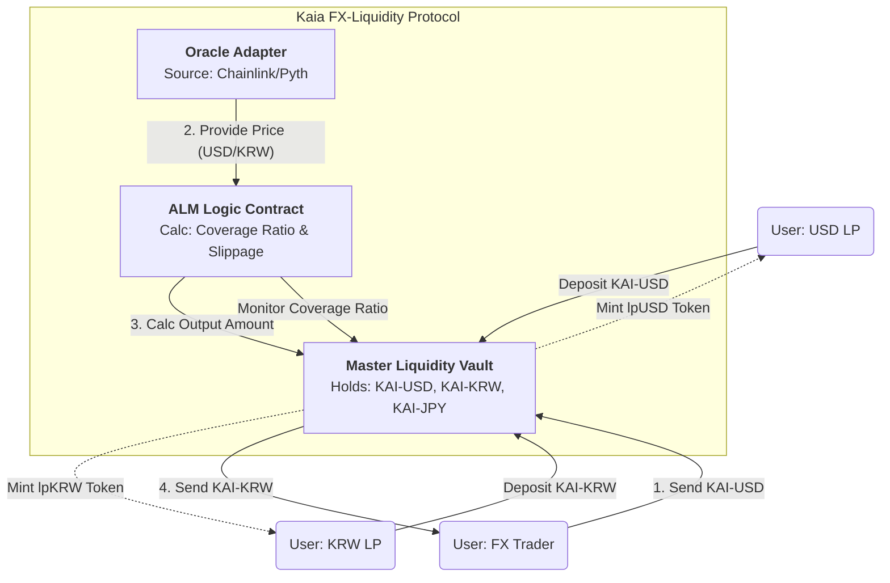

# Design Proposal: Single-Sided Liquidity Pools for FX-Linked Stablecoins on Kaia

## 1. Concept Overview

**Single-Sided Liquidity (SSL)** is a DeFi mechanism that allows Liquidity Providers (LPs) to deposit a single type of asset into a liquidity pool, rather than the traditional requirement of depositing a pair of assets of equal value (e.g., 50% USDT / 50% ETH).

In the context of traditional Automated Market Makers (AMMs) like Uniswap V2, LPs suffer from "Impermanent Loss" (IL) due to price divergence between the paired assets. Single-sided pools mitigate this by separating the accounting of each asset, often using an **Asset-Liability Management (ALM)** model.

**Relevant Industry Examples:**

*   **Platypus Finance (Avalanche):** Utilizes a "Coverage Ratio" mechanism where assets are pooled together but liabilities are tracked individually, allowing for zero-slippage swaps when the pool is balanced.
*   **Curve V2:** While often multi-asset, its stableswap invariant logic is the foundation for concentrating liquidity around a specific peg (price = 1.0 or an Oracle rate).

---

## 2. Application to FX-Linked Stablecoins

The Foreign Exchange (FX) market is the largest financial market globally, yet on-chain FX is fragmented. Current DeFi solutions force LPs to hold exposure to currencies they may not want (e.g., a US investor providing liquidity for a KRW/JPY pool would traditionally need to hold both KRW and JPY).

**Problem Statement:**

1.  **Fragmentation:** Liquidity is split across hundreds of pairs (USD-KRW, USD-JPY, KRW-JPY).
2.  **FX Risk for LPs:** LPs hesitate to provide liquidity for volatile exotic currencies due to the risk of currency depreciation.

**The Solution:**
By applying Single-Sided Liquidity on the **Kaia blockchain**, we can create a **"Global FX Hub."**

*   **LPs** deposit only their native currency (e.g., users in Korea deposit KAI-KRW; users in the US deposit KAI-USD).
*   **The Protocol** aggregates all liquidity into a shared reservoir.
*   **Traders** can swap *Any-to-Any* asset (e.g., KAI-KRW to KAI-JPY) using the aggregate liquidity, routed via Oracle pricing.

This design maximizes capital efficiency because KAI-USD liquidity isn't locked in a specific pair; it facilitates trades against KRW, JPY, EUR, or any other supported asset.

---

## 3. Proposed Design Architecture

### A. Core Mechanism: The "Coverage Ratio" Model

Instead of the constant product formula ($x * y = k$), this design uses an Oracle-guided pricing model with a dynamic slippage penalty based on the **Coverage Ratio (CR)**.

*   **Coverage Ratio (CR)** = `Total Cash in Pool / Total Liabilities to LPs`
*   **Equilibrium:** When CR = 100%, the pool is healthy.
*   **Slippage Logic:**
    *   If a user sells KAI-USD into the pool (increasing Cash), the CR for USD goes >100%. The protocol offers a slight premium to encourage this.
    *   If a user buys KAI-USD from the pool (decreasing Cash), the CR for USD drops <100%. The protocol applies a slippage fee to discourage draining the liquidity.

### B. Pricing & Oracles

Since FX rates fluctuate (unlike stablecoins pegged to the same fiat), the protocol cannot assume a 1:1 ratio.

*   **Primary Pricing:** Uses high-fidelity Oracles (e.g., Chainlink or Pyth on Kaia) to fetch real-time off-chain FX rates (e.g., 1 USD = 1300 KRW).
*   **Execution Price:** `Oracle Price * (1 - Dynamic Slippage Fee)`

### C. Kaia Compatibility & Integration

*   **Token Standard:** Supports KIP-7 (Kaia's fungible token standard).
*   **Gas Efficiency:** Kaia’s low gas fees allow for frequent Oracle updates, which is critical for accurate FX pricing.
*   **Finality:** Kaia’s immediate transaction finality prevents "Free Option" arbitrage (where traders exploit the time gap between trade submission and block confirmation).

---

## 4. Risks, Limitations & Trade-offs

### A. Oracle Latency & Toxic Flow

*   **Risk:** If the real-world FX market moves faster than the on-chain Oracle updates, arbitrageurs can trade against the "stale" price, draining value from LPs.
*   **Mitigation:**
    *   Implement a **"Volatility Circuit Breaker"**: If the off-chain price moves >0.5% in 1 minute, pause trading temporarily.
    *   Use Kaia’s fast block times to update Oracles more frequently than Ethereum L1.

### B. The "Bank Run" Risk (Liquidity Crunch)

*   **Risk:** In a single-sided pool, if everyone wants to withdraw KAI-USD (the strongest currency) but the pool is filled with KAI-KRW (a potentially weakening currency), the KAI-USD Coverage Ratio could drop dangerously low.
*   **Mitigation:**
    *   **Withdrawal Limits:** Dynamic withdrawal fees increase as the Coverage Ratio drops.
    *   **Interest Rate Model:** Automatically increase the APY for KAI-USD deposits when liquidity is low to attract new LPs.

### C. Assumption of Peg

*   **Assumption:** We assume the underlying stablecoins (KAI-USD, KAI-KRW) maintain their peg to their fiat counterparts.
*   **Trade-off:** If the underlying stablecoin de-pegs, the liquidity pool could absorb the "bad" asset. The protocol must include an emergency shutdown triggers if the stablecoin itself deviates from $1.00.

---

### Part 2: Architecture Workflow Diagram

*(Below is a description and Mermaid code. You can use the Mermaid Live Editor or draw this in draw.io/Figma based on the structure below.)*

#### Diagram Logic for the Slide

**Title:** Kaia FX-Liquidity Hub (Single-Sided Architecture)

**Left Side: Liquidity Providers (LPs)**

*   **Actor:** KRW LP
    *   *Action:* Deposits KAI-KRW
    *   *Receives:* lpKRW Token (Yield Bearing)
*   **Actor:** USD LP
    *   *Action:* Deposits KAI-USD
    *   *Receives:* lpUSD Token (Yield Bearing)

**Center: The Protocol (Smart Contracts)**

*   **Master Vault:** Holds all assets (KAI-USD, KAI-KRW, KAI-JPY).
*   **Logic Unit (Asset Liability Manager):**
    *   Tracks "Liabilities" (How much is owed to LPs).
    *   Calculates "Coverage Ratio."
*   **Oracle Module:** Feeds real-time FX rates (e.g., Chainlink: USD/KRW).

**Right Side: Users (Traders)**

*   **Actor:** FX Trader
    *   *Action:* Swaps KAI-USD -> KAI-KRW.
    *   *Flow:* Sends USD -> Vault Checks Oracle -> Vault Sends KRW -> User.

**Bottom: Governance/Treasury**

*   Collects trading fees.
*   Distributes rewards to LPs.

#### Mermaid Code (For your reference or direct use)

---

### Part 3: 会议/面试备战指南 (中文解析) 

这份指南用于帮助你消化上面的内容，并准备可能被问到的问题。

#### 1. 核心概念 (Concept)

*   **怎么解释单币种池？**
    *   *话术：* 传统AMM像是一个“鸳鸯锅”，你必须同时放两种菜（双币）；单币种池像是一个“自助餐厅”，LP只想提供USD就只放USD，只想提供KRW就只放KRW。协议负责在后台通过算法匹配。
*   **为什么适合外汇（FX）？**
    *   *话术：* 外汇市场极度碎片化。如果用传统AMM，我要做 USD/KRW, USD/JPY, USD/EUR 三个池子，流动性被分散了。用单币种池，所有的USD都在一个大池子里，任何人想换任何货币，都可以共享这份深度（Shared Liquidity）。

#### 2. 设计亮点 (Design)

*   **Oracle (预言机) 的作用：**
    *   外汇不像 USDC/USDT 永远锚定 1:1。USD/KRW 的汇率每秒都在变。所以我们**不能**用 `x*y=k` 这种自动定价公式，必须依赖外部 Oracle 告诉合约现在的汇率是多少。
*   **覆盖率 (Coverage Ratio) 是什么？**
    *   这是单币种池的风控核心。
    *   如果你存了100块，池子里有100块现金，覆盖率=100%，很健康。
    *   如果大家都把池子里的USD买走了，只剩下50块现金，但协议还欠LP 100块，覆盖率=50%。这时候谁想再买USD，协议就会收巨额手续费（Slippage），阻止池子干涸。

#### 3. 针对 Kaia 链的特殊优化 (Kaia Compatibility)

*   **Finality (确定性)：** 外汇交易最怕“抢跑”（Front-running）。Kaia 的 IBFT 共识机制能做到即时确认（Immediate Finality），这意味着黑客很难利用出块的时间差来套利。这点是 Kaia 做 DeFi 的巨大优势。
*   **Gas Fee：** 因为依赖 Oracle 喂价，如果 Gas 太贵（像以太坊主网），Oracle  обновления 就会很慢，导致价格滞后。Kaia Gas 便宜，支持高频 Oracle 更新。

#### 4. 潜在的刁钻问题 (Q&A Prep)

*   **Q: 如果 Oracle 价格被攻击了怎么办？**
    *   *A:* 我们会使用“多源聚合”（Chainlink + Pyth 取中位数），并且设置“熔断机制”。如果价格短时间内波动超过 1%，合约自动暂停交易。
*   **Q: LPs 的收益从哪来？**
    *   *A:* 1. 交易手续费（Trading Fees）；2. 协议代币激励（Kaia Ecosystem Rewards）；3. 闪电贷费用（如果开放 Flash Loans）。
*   **Q: 为什么不用 Uniswap V3？**
    *   *A:* Uniswap V3 对于普通 LP 来说管理难度太高（需要手动调整区间）。单币种池对 LP 来说是 "Deposit and Forget"（存入即忘），用户体验更好，利于吸引传统资金（Institutional Capital）。

### 准备步骤：

1.  **复制 Part 1** 到 Google Doc，调整格式（加粗标题，检查排版）。
2.  **使用 Part 2** 的逻辑画出一张简单的流程图（推荐用 Draw.io 或 Figma）。画图时要把 "Oracle" 和 "Coverage Ratio Check" 这两个步骤画清楚，这是技术含量的体现。
3.  **熟读 Part 3**，确保你能用英文简单复述 "Coverage Ratio" 和 "Shared Liquidity" 的概念。
